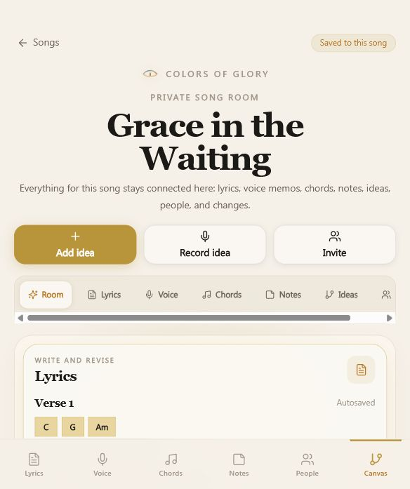

# Codex Whiteboard Flow Performance Audit v2

Date: 2026-06-04
Scope: Colors of Glory songwriting whiteboard, private song room flow, canvas layers, invite-to-song entry points, mobile 390px render, route smoke, bundle budget, instant-feel UX.

Screenshot artifact:



## Stopwatch Verdict

The whiteboard flow is in a good place for a prototype and now passes Codex QA Gate v1. The route is lazy-loaded, the old wide feature routes redirect into the canvas, mobile smoke passes, and the current bundle budget is still inside the guardrails.

The big warning is not today. The big warning is tomorrow, when the full songwriting engine arrives.

Right now the app feels like a calm private song room. If the next 33 features mount directly into this same React tree, it will start feeling like a beautiful room where every cabinet opens at once. Pretty, but not instant.

Current grade:

| Area | Grade | Why |
|---|---:|---|
| Current prototype speed | A- | QA gate passes, canvas route is split, route smoke is clean |
| Scalability readiness | B- | Tree rendering and work layers are not ready for large live rooms |
| Mobile songwriting feel | B+ | The room metaphor works, but layer switching and duplicated tab names need polish |
| 33-feature readiness | C+ | Needs stress harness, virtualization, audio isolation, and feature-plugin chunk discipline |

## Fresh Evidence

Command:

```bash
npm.cmd run qa:codex
```

Result: passed hard checks.

Passed:
- lint
- typecheck
- production build
- Vitest suite
- bundle budget
- old-brand content scan
- legacy asset filename scan
- basic accessibility source checks
- instant-feel source checks
- placeholder route scan
- production preview route smoke across 23 routes

Warnings:
- Browserslist/caniuse-lite is stale.
- Shared vendor chunk is still on the watchlist: about 203.1 kB raw, 52.7 kB gzip.

Current built bundle shape:

| Asset | Raw | Gzip |
|---|---:|---:|
| Main JS | 314.7 kB | 101.5 kB |
| Main CSS | 87.8 kB | 16.1 kB |
| Shared client chunk | 203.1 kB | 52.7 kB |
| SongCanvasPage | 15.16 kB | 5.48 kB |
| SongCanvasTrees | 7.67 kB | 2.22 kB |
| SongCanvasWorkLayers | 7.86 kB | 2.52 kB |
| SongCanvasCollabLayers | 3.47 kB | 1.41 kB |

Browser-rendered canvas sample at `/songs/1/canvas`:

| Metric | Result |
|---|---:|
| Initial DOM nodes | 593 |
| Initial buttons | 28 |
| Console errors/warnings | 0 |
| Canvas region present | Yes |
| Add Idea result | New idea appears |
| DOM after Add Idea | 606 nodes |
| Buttons after Add Idea | 29 |
| Approx Add Idea click plus settle sample | 468 ms |

Note: the click sample is a simple browser automation observation, not a lab-grade INP trace. It is still useful as a sniff test: Add Idea is functional, but should get a tighter measured target before real persistence, activity logging, and optimistic updates arrive.

## What Is Working

### 1. The product shape is right

The core flow is now pointed toward one private room:

- `/songs/:id/canvas` is the main whiteboard.
- `/songs/:id/lyrics`, `/voice`, `/chords`, `/notes`, `/people`, `/activity`, and `/credits` route back into canvas layers.
- The Song Workspace card actions send the user into canvas layers instead of spreading the product across disconnected pages.

That is the right architecture for Colors of Glory. Songwriters should not feel like they are changing departments. They should feel like they are moving deeper inside one song.

### 2. The canvas route is split

`SongCanvasPage` lazy-loads:

- `SongCanvasWorkLayers`
- `SongCanvasTrees`
- `SongCanvasCollabLayers`

This is the right performance instinct. The canvas should be one room, but the code should still load like small tools behind doors.

### 3. QA now has a reliable foothold

Codex QA Gate v1 covers:

- mobile 390px render
- canvas route smoke
- old-brand scan
- route split checks
- stable card height checks
- named canvas region
- memoized canvas node rendering

That gives the team a useful tripwire before the 33 features start adding real weight.

### 4. Browser rendering is currently clean

The built preview showed:

- no console errors
- no console warnings
- clear whiteboard headings
- named canvas region
- Add Idea works
- DOM size is reasonable for prototype scope

This is the "good floor." Now the job is to protect it.

## Performance Findings

### P0 - Full QA was red, now fixed

During the audit, the branch had typecheck failures in invite and people code. I patched the small blockers:

- removed the missing `getAvatarColor` import from `songContext`
- kept invite OTP retry state typed without a forced state cast
- added `collaborator` role copy/label coverage in `RoleToast`
- changed the People Supabase collaborator load from chained `.catch()` to an async loader
- restored the catalog card `minHeight: "140px"` instant-feel guard

Codex QA Gate v1 now passes.

Why this matters for whiteboard performance:

A performance gate that cannot run is not a gate. It is a decorative sign. The gate is alive again.

### P1 - Canvas route is already close to its chunk ceiling

Current `SongCanvasPage` route chunk is about 15.16 kB raw. The current canvas budget target is 16 kB raw.

This is still passing, but the margin is thin.

Required rule:

- no drag engine in `SongCanvasPage`
- no audio recorder in `SongCanvasPage`
- no waveform processor in `SongCanvasPage`
- no transcript editor in `SongCanvasPage`
- no compare/merge/version tooling imported at the base canvas level

Every heavy feature must lazy-load behind the exact interaction that opens it.

### P1 - Work layers all mount at once

Source:

- `src/components/cog/SongCanvasWorkLayers.tsx`

Current pattern:

- Lyrics renders.
- Voice renders.
- Chords renders.
- Notes renders.
- The active layer only changes border emphasis.

This is fine for static mock content. It is not fine once those layers become real:

- rich lyrics editor
- real waveform playback
- MediaRecorder
- transcription states
- chord detection
- inline comments
- autosave queues

Required next optimization:

- In `room` mode, render lightweight summaries.
- In focused layer mode, mount only that real tool.
- Keep inactive heavy tools unmounted.
- Preserve small summary cards so the room still feels connected.

Codex rule:

One room does not mean one mounted component forest.

### P1 - Ideas Tree and Final Tree need virtualization before real scale

Source:

- `src/components/cog/SongCanvasTrees.tsx:139`

Current pattern:

```tsx
cards.map((card) => (
  <CanvasNode ... />
))
```

This is fine for 5 cards. It is not ready for a song with:

- 80 idea fragments
- 40 voice takes
- 120 line suggestions
- 30 chord variants
- review queue items
- version snapshots
- collaborator branches

Required before serious whiteboard expansion:

- window the visible cards
- group older ideas by section
- cap initial mounted nodes
- render only visible cards plus overscan
- isolate selected-card detail from list rendering

Stress targets:

| Scenario | Target |
|---|---:|
| 50 cards | instant |
| 250 cards | no visible jank |
| 1,000 cards | usable with grouping/windowing |
| 5,000 cards | not fully mounted, ever |

### P1 - Canvas node memoization is weakened by inline callbacks

Source:

- `src/components/cog/SongCanvasTrees.tsx:145`

Current pattern:

```tsx
onSelect={() => onSelect(card)}
```

`CanvasNode` is memoized, which is good. But this inline callback creates new function identities during parent renders.

Required fix:

- pass `card.id` instead of the whole card
- use a stable `onSelectCardId` callback
- derive the selected card outside the list
- add a render-count regression test

Target:

Selecting one card should not cause every visible card to re-render.

### P1 - Layer switching uses push history and unguarded smooth scroll

Source:

- `src/pages/SongCanvasPage.tsx:230`
- `src/pages/SongCanvasPage.tsx:232`
- `src/components/cog/SongTabBar.tsx`

Current pattern:

- layer chip click calls `navigate(..., { replace: false })`
- then calls `scrollIntoView({ behavior: "smooth" })`
- bottom tab navigation also pushes new history entries

Risk:

- back button becomes a layer-by-layer replay
- repeated taps can queue smooth scrolling
- reduced-motion users still get forced smooth movement
- mobile can feel gummy when scroll, state update, and lazy reveal overlap

Required fix:

- use `replace: true` for layer changes
- use push only for true route transitions
- check whether the target is already visible
- use instant scroll for reduced-motion users
- scroll inside `requestAnimationFrame` after state settles

This is both performance and Church Center UX: calm movement, no surprise history stack.

### P1 - Some entry points still aim at `/lyrics`

Sources:

- `src/pages/invite/InviteTeamIntroPage.tsx:47`
- `src/pages/invite/InviteJoinPage.tsx:186`
- `src/pages/ReturningHomePage.tsx:82`
- `src/pages/ReturningHomePage.tsx:129`
- `src/pages/onboarding/CaptureFirstIdeaPage.tsx:219`
- `src/pages/onboarding/VoiceMemoAddedPage.tsx:148`

These routes redirect correctly, but the user intent should be direct:

```txt
/songs/:id/canvas?layer=lyrics
```

Why this matters:

- removes a redirect hop
- keeps analytics cleaner
- reinforces the one-room mental model
- makes invite-to-first-action feel more immediate

The redirect is useful as backward compatibility. New code should stop targeting it.

### P2 - The layer controls have duplicate accessible names

Browser observation:

- `Voice` button count: 2

The layer rail and bottom tab both expose `Voice`. Visually this is understandable. For automation and assistive tech, it creates ambiguity.

Required fix:

- top chip: `aria-label="Show voice layer"`
- bottom tab: `aria-label="Open voice layer"`
- keep visible label as `Voice`

This is small, but polished products win on small things.

### P2 - Layer chips are 40px tall, below the 44px touch target

Browser observation:

- layer chip heights: 40px
- Path button height: 40px

Apple target is 44px minimum. The app standard also calls for 44px minimum.

Required fix:

- change layer chips from `min-h-10` to `min-h-11`
- same for the Path chip
- verify the chip rail still fits at 390px

This is not just accessibility. It makes the app feel calmer under thumbs.

### P2 - Add Idea works, but needs an optimistic-state contract

Current Add Idea behavior:

- adds the new card immediately
- marks status as saving
- updates card meta after a short timeout

This is the correct feel direction.

Before Lovable persistence arrives, define the contract:

- optimistic card appears immediately
- temporary id maps to server id
- failed save keeps the card locally with a calm retry state
- activity log writes after successful persistence
- no global loading overlay
- no lost text if offline

Target:

Tap to visible card: under 100 ms.
Save confirmation: under 600 ms if backend is healthy.
Offline save: card remains visible with retry.

### P2 - Voice memo performance contract must be locked before real recording

Current voice memos are static and cheap.

Real voice memos are where performance usually gets expensive.

Rules before real capture ships:

- one audio engine per song room
- one active `<audio>` element
- waveform peaks precomputed and stored
- CSS transform for playhead movement
- no React setState loop for every audio tick
- lazy-load recorder on first record intent
- waveform extraction off main thread
- upload in a background queue
- keep raw audio out of React component state

The voice memo is core content, but audio processing is not allowed to sit in the render path.

### P2 - Mobile test timing is variable

Observed mobile render timings:

- whiteboard smoke was as low as about 1.15s in the final full QA run
- earlier isolated/full runs ranged around 3.3s to 7.7s

This variance is a warning. The test passes, but it tells us the current suite is not yet a precise performance benchmark.

Required next gate:

- add browser-based route transition timing
- add DOM node count budget
- add long-task observer
- add interaction timing for Add Idea, layer switch, and Path mode
- run at 390px and desktop companion width

## Songwriting UX Flow Audit

### Entry Into The Room

Current flow:

```txt
Catalog -> Song Workspace -> Canvas layer
Invite -> Lyrics redirect -> Canvas layer
Onboarding capture -> Lyrics redirect -> Canvas layer
Returning home -> Lyrics redirect -> Canvas layer
```

Best flow:

```txt
Any source -> /songs/:id/canvas?layer=[right-layer]
```

The app should feel like every road leads straight into the song room.

### Writing Lyrics

Current feel:

- lyrics are visible inside the room
- chords sit near lyric sections
- voice memo context is embedded

Performance risk:

- future rich text editing must not mount in room overview
- autosave must be debounced and section-scoped
- line suggestions must not re-render the full song

Required model:

- room overview = read-only summary
- focused lyrics layer = editable section surface
- line-level tools lazy-load on line focus

### Capturing Voice

Current feel:

- Record Idea quickly creates a voice card and moves user toward voice

Performance risk:

- recording UI, waveform rendering, upload, playback, and transcription can easily pile into one hot path

Required model:

- record intent opens focused capture state
- waveform appears from precomputed or lightweight live peaks
- recording does not trigger parent canvas re-renders
- upload status is local to the memo card

### Arranging Ideas

Current feel:

- Ideas Tree and Final Tree are clear
- Add to Final protects the original idea
- Path mode exists

Performance risk:

- large trees will become slow if every node remains a full button card

Required model:

- normalized entities by id
- ordered id arrays per tree
- section grouping
- windowed lists
- stable callbacks
- selected detail outside list render path

### Collaborating

Current feel:

- people and activity are visible in the room
- calm updates, no aggressive notification energy

Performance risk:

- live collaboration can cause frequent updates across the room

Required model:

- activity feed paginated
- collaborator presence throttled
- comments/suggestions scoped by section
- optimistic updates local to the changed entity
- no whole-room refetch on every activity event

## The 33-Feature Rulebook

Every new songwriting feature must answer these before implementation:

1. Which layer does this live inside?
2. What is the smallest summary shown in room mode?
3. What code chunk loads only after intent?
4. What data updates optimistically?
5. What does offline/failure look like without losing work?
6. How many DOM nodes does it add at rest?
7. Does it re-render the whole canvas?
8. Does it respect reduced motion?
9. Does it keep the song title and safety state visible?
10. Does it make the room deeper, or just wider?

If a feature makes the app wider, it needs redesign before code.

## Required Codex Gate v2

Add a whiteboard-specific stress gate:

```txt
render /songs/1/canvas with:
- 50 cards
- 250 cards
- 1,000 cards
- 5,000 cards
```

Measure:

- initial DOM node count
- first render time
- layer switch time
- Add Idea time
- selected-card render count
- scroll smoothness
- long tasks over 50 ms
- console errors

Budgets:

| Budget | Target |
|---|---:|
| Canvas route chunk | <= 16 kB raw until approved |
| Feature plugin chunk | <= 8 kB raw by default |
| Initial mounted card nodes | <= 80 |
| Add Idea visible response | < 100 ms |
| Layer switch response | < 150 ms |
| Cached audio play start | < 250 ms |
| Recording React updates | <= 10/sec |
| CLS during layer switch | < 0.02 |

## Next Fix Order

1. Direct all new entry points to `/songs/:id/canvas?layer=lyrics` instead of `/songs/:id/lyrics`.
2. Switch canvas layer navigation to `replace: true` and guard smooth scroll.
3. Raise layer chip and Path button touch targets to 44px minimum.
4. Split room summaries from focused heavy tools.
5. Stabilize canvas node callbacks.
6. Add the canvas stress harness.
7. Define the audio performance contract before real recorder work.
8. Keep the base canvas route under 16 kB raw.

## Final Codex Read

The whiteboard is not slow today.

The whiteboard is vulnerable to becoming slow if the next features enter casually.

The product direction is correct: one song, one room, many layers. The performance strategy must match that: one visible room, many lazy tools, zero wasted re-renders, no heavy audio on the main render path, and no redirects on the way to the first creative action.

The room is ready for disciplined feature work. It is not ready for a feature pile-on.
