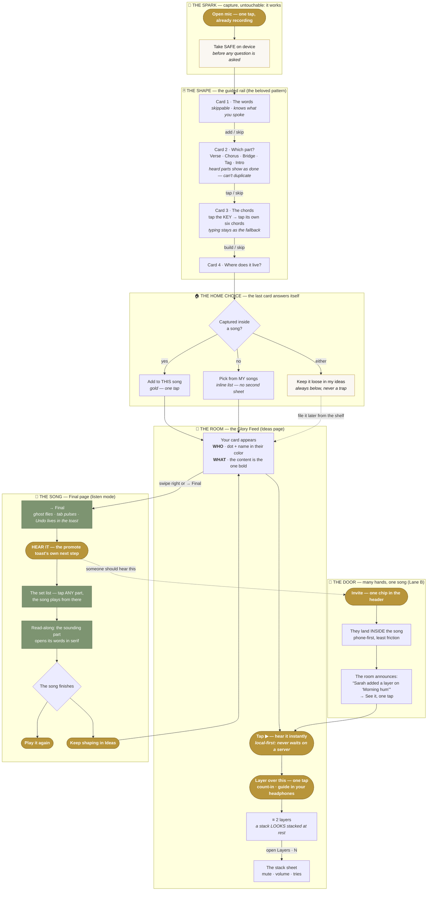
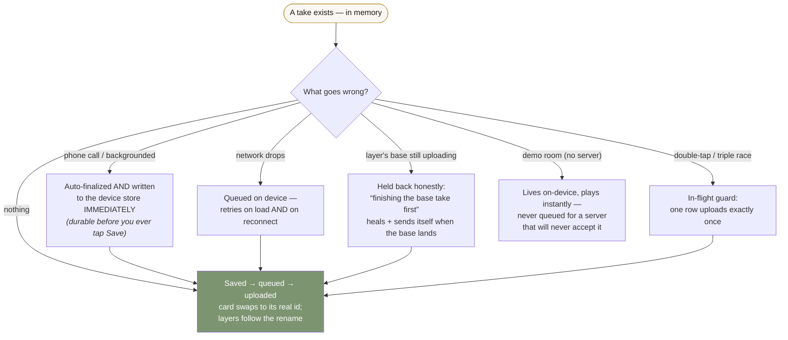

# THE GOLDEN PATH — Colors of Glory's worldclass flow
### From a hum in your head to a song your people can hear

The design grammar of the whole app is the pattern the guided capture rail proved:
**one card at a time · every card skippable · the take already safe · it ends in where it lives.**
These diagrams are the contract — every surface either follows this grammar or has a reason.

The three laws every arrow obeys:
1. **Momentum** — finishing any step presents the next most-likely step, one tap away. No dead stops.
2. **One bold thing** — at any moment, one dominant piece of information (gold = the one primary act).
3. **The 8-year-old test** — every fork is guessable by a child; every tap does what it looks like.

---

## D1 · The whole journey — spark → shape → room → song → door → return

**Why this shape wins:** every subgraph ends by *handing you* to the next one. The rail ends in the
home choice; the home choice ends in the room; the room's cards each carry their own next act;
promoting ends in *hearing*; hearing ends in *playing again or shaping more*; and the door feeds
arrivals straight back into listening. The loop never opens.

---

## D2 · The guided rail — the beloved pattern, exactly

```mermaid
flowchart LR
  S(["STOP tapped —<br/>take already safe"]) --> P["Progress dots · 1 of 4<br/><i>the active dot stretches</i>"]
  P --> W

  subgraph RAIL["One card at a time — mounted alone, 240ms rise"]
    W["<b>The words</b><br/>“Your spoken words are already below —<br/>add more, or skip”"]
    K["<b>Which part?</b><br/>chips: Verse · Chorus · Bridge · Tag · Intro<br/>✓ heard chips are gold + done"]
    H["<b>Chords underneath?</b><br/>KEY chips → that key's six chords →<br/>tap-built progression, tap-out to remove"]
    L{"<b>Where does it live?</b>"}
    W -->|"Add words / Skip"| K
    K -->|"one tap / Skip"| H
    H -->|"Add chords / Skip"| L
    K -->|"◀ Back"| W
    H -->|"◀ Back"| K
    L -->|"◀ Back"| H
  end

  L -->|"in a song: Add to ⟨song⟩ (gold)"| R1(["Committed to the canvas"])
  L -->|"no song: my songs, inline list"| R2(["Filed into the picked song"])
  L -->|"Keep it loose"| R3(["The ideas shelf — shape it any time"])
  X["✕ dismiss at ANY step"] -.-> E["Full editor —<br/>nothing lost, all blocks kept"]

  R1 --> M(["“Saved — Hear it?”<br/>momentum never stops"])
  R2 --> M

  style S fill:#FAF7F2,stroke:#B8953A,color:#1C1A17
  style R1 fill:#B8953A,color:#fff
  style R2 fill:#B8953A,color:#fff
  style M fill:#7d9471,color:#fff
```

**The rules this pattern proves** (apply them anywhere a flow feels confusing):
- The thing is **safe before the first question** — so skipping everything is fearless.
- Each card asks **one question** with one obvious answer-gesture (type / tap a chip / pick a row).
- The rail **already knows** what happened (spoken words acknowledged, heard sections pre-checked) — it never asks as if it wasn't listening.
- The last card is always **"where does it live?"** — and it answers itself (current song → one gold tap; no song → the list is *right there*; loose → always allowed).
- **Back** is real, **Skip** costs nothing, **✕** lands in the full editor, never in loss.

---

## D3 · The safety rails — every failure keeps the idea

---

## Where the grammar is NOT yet applied (the next passes)

| Moment | Today | The rail-grammar version |
|---|---|---|
| **New song creation** | a name dialog | Card 1: hum or type its first spark → Card 2: name it (suggested from the words) → Card 3: who is it for? *(the "for..." dedication)* → lands in the room |
| **Inviting someone** (Lane B) | share sheet | Card 1: who? → Card 2: what can they do? (one human sentence, sane default) → "the door is open" |
| **First open of a song room** | the feed | One welcome card: "This is ⟨song⟩'s room — everything for it stays here" → dissolves into the feed |

*Last updated: 2026-08-10 · The guided rail (`GuidedShapeRail.tsx`) is the reference implementation of this grammar.*
